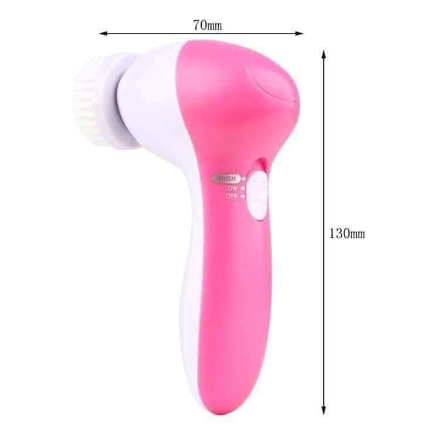

**Description**
5in1 Beauty Care Massager
 
မျက်နှာသစ်စက်လေး နဲ့ မျက်နှာသစ်ပြီးတဲ့အချိန်မှာ
မျက်နှာက တင်းတင်းရင်းရင်းနဲ့ အညစ်အကြေးတွေ အကုန်ပြောင်စင် သွားလို့  နေလို့ အရမ်းကောင်းပါတယ် ...
မျက်နှာပေါ်က မမြင်နိုင်တဲ့ ဖုန် ၊ အဆီဖု နဲ့ အညစ်အကြေး များကိုအချိန်တိုအတွင်း လက်ဖြင့် သန့်စင်တာထက် ပိုမိုသန့်စင်အောင် ဆေးကြောသန့်စင်နိုင်တဲ့ 5 in 1 မျက်နှာသစ်စက်ကလေးပါ ...
Beauty Care Massager လေးကဆိုင်တွင်သွားရောက် အချိန်မပေးနိုင်တဲ့သူများအတွက် အချိန်ကုန်ငွေကုန်သက်သာစေမှာပါ ...
Beauty Care Massager စက်လေး ကို AA ဓာတ်ခဲအသေးလေးနှစ်လုံးထည့်ရမှာဖြစ်ပြီးအသုံးပြုပြီးပါက ဓါတ်ခဲလေး ကို ပြန်ထုတ်ထားရင်ကြာရှည်ပိုခံပါတယ် ...
(1) နူးညံ့တဲ့ Soft Brush
နူးညံ့တဲ့ Soft Brush ဟာဆိုရင်မျက်နှာပြင်အနှံ့ဖွဖွလေး ပွတ်တိုက်ကာ မျက်နှာကိုသန့်စင်ရာ၌အသုံးပြုပေး ရမှာဖြစ်ပြီးနှစ်သက်ရာ Cleansing Cream တို့ဖြင့် တွဲဖက်အသုံးပြုလို့ရတဲ့ Brushလေးဖြစ်ပါတယ် ...
(2)Rollor Messager
Rollor Messager လေး ကတော့ မျက်နှာပြင် ကို သွေးလည်ပတ်မှုကောင်းစေရန် နှင့် အရေးအကြောင်းဖြစ်ခြင်းမှ ကာကွယ်ပေးရန် Massage လုပ်ပေးရာ၌ အသုံးပြုရမှာဖြစ်ပါတယ် ...
(3) Makeup Sponge 
Makeup Sponge လေးကို မိတ်ကပ်လ်ိမ်းရာတွင် သုံးပါက မိတ်ကပ်ကို လက်ဖြင့်လိမ်းတာထက်  ပိုမိုညက်ညောသဘာဝကျလှပစေပြီး ဖော့လေးပေါ် မိတ်ကပ်ရည်ထည့်ပြီး စက်လေးဖြင့် အသာအယာ ပင့်သက်လိုက်ရုံဖြင့် ညီညာညက်ညောစေပြီး မိတ်ကပ်မညီတာ ကွက်တာတို့ကိုလည်း ကင်းဝေးစေလို့  ဆောင်ထားသင့်တဲ့ပစ္စည်းလေးဖြစ်ပါတယ် ...
(4)Latex Soft Sponge 
Latex Soft Sponge လေးဟာဆိုရင် လွန်စွာနူးညံ့ပီး မျက်လုံးနားတဝိုက်သွေးလည်ပတ်မှုကောင်းစေရန်နှင့် မျက်လုံးအောက်အရေးကြောင်းမဖြစ်အောင် ကာကွယ်ပေး တဲ့ပစ္စည်းလေးပါ ..
(5)Crude Polish
Crude Polish လေးကတော့ ဂျိုင်း၊ဒူးခေါင်း၊ဖနောက် တံတောင်ဆစ် လိုနေရာလေး တွေ ကိုနူးညံ့ဖြူဖွေးစေဖို့အတွက် အသုံးပြုပေးရပေးရမှာပါ ...
မိမိအသုံးပြုချင်သည့် ပစ္စည်းလေး ကိုစက်လေးရဲ့  ထိပ်မှာတပ်ဆင်ကာ ဓာတ်ခဲလေးထည့်ပြီး လိုသလို အနှေးအမြန်ခလုတ်လေး နှိပ်ကာအသုံးပြုပေးရမှာဖြစ်ပြီး အသုံးပြုပြီးပါက ဓါတ်ခဲလေး ကိုပြန်ထုတ်ထားရပါမယ် ...
အသုံးပြုပြီးပစ္စည်းတွေကို ဆပ်ပြာတွေအဆီတွေ နဲ့မလျော်ရပါဘူး ၊ ရေသန့်လေးနဲ့ဆေးကြော သန့်စင်ပေးရမှာပဲဖြစ်ပါတယ် ...
နေပူလည်း လုံး၀မလှန်းရပါဘူး ...
အမျိုးသား ၊ အမျိုးသမီးမရွေးအသုံးပြုနိုင်လို့ အိမ်တိုင်းတခုလောက်တော့ ဆောင်ထားသင့်ပါတယ်နော် ...

**Price:** 
5500 Kyats

